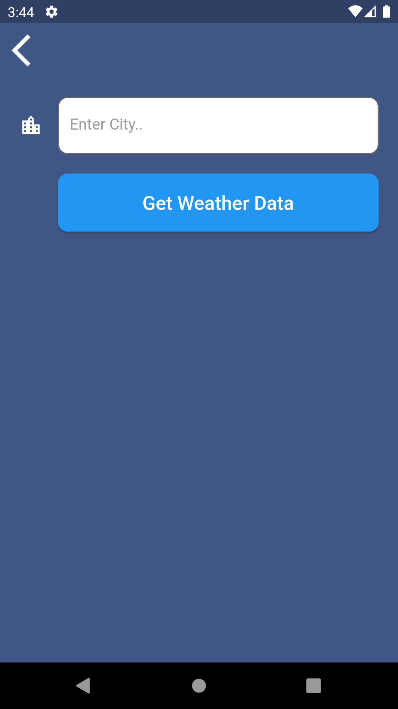

A Weather App with Flutter 

Features: 
:heavy_check_mark: Displays the location name,air temperature and description of the weather condition according to the users location at home screen. 
:heavy_check_mark: Displays warning and information messages depending on the weather condition. 
:heavy_check_mark: Also displays feels like temperature,humidity level,pressure value and wind value by fetching data from API. 
:heavy_check_mark: If the user wishes, can check the weather informations of other cities by searching. 
:heavy_check_mark: Background images change depending on the time zone of the user or the weather. For example, if the user's time is 9am, the background will be in the morning theme, if it is 22pm, the background will be in the night theme. If the weather is snowy, it will be in the snow theme, and if it is raining, it will be in the rain theme. 

Technologies: 
:pushpin: Flutter 
:pushpin: Dart 
:pushpin: Fetch data from API ([OpenWeatherMap](https://openweathermap.org/api)) 
:pushpin: geolocation 

 
Home Screen 
 
Search Other Cities Screen  
 

This project created by [YusufUguz](https://github.com/YusufUguz) 

